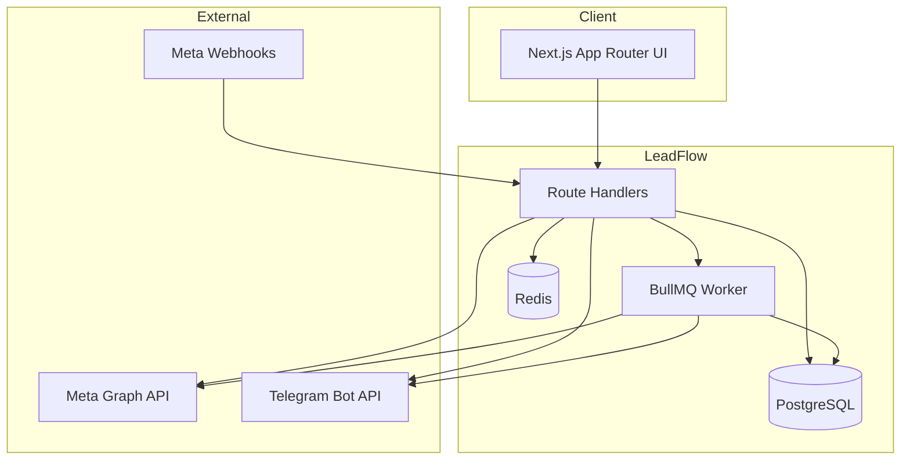

# LeadFlow — Architecture & Implementation Plan

## 1. Product Overview

**LeadFlow** is a multi-tenant SaaS platform that connects Facebook Lead Ads to Telegram. End users complete the entire setup through a guided UI — no Postman, Graph API Explorer, or manual token generation.

### Core User Journey

```
Register → Connect Facebook → Select Pages → Enable Forms → Connect Telegram → Receive Leads
```

### System Context



---

## 2. Tech Stack

| Layer | Technology |
|-------|------------|
| Frontend | Next.js 15 App Router, TypeScript, TailwindCSS, shadcn/ui |
| i18n | next-intl (ru default, en) |
| Backend | Next.js Route Handlers |
| Database | PostgreSQL + Prisma ORM |
| Queue | BullMQ + Redis |
| Auth | NextAuth v5 (Credentials + session) |
| Deployment | Railway (web + worker + postgres + redis) |

---

## 3. Folder Structure

```
leadflow/
├── app/
│   ├── [locale]/
│   │   ├── (auth)/
│   │   │   ├── login/page.tsx
│   │   │   ├── register/page.tsx
│   │   │   ├── forgot-password/page.tsx
│   │   │   └── reset-password/page.tsx
│   │   ├── (dashboard)/
│   │   │   ├── layout.tsx              # Sidebar + header
│   │   │   ├── dashboard/page.tsx      # Overview stats
│   │   │   ├── facebook/page.tsx       # FB connection + pages
│   │   │   ├── forms/page.tsx          # Lead forms management
│   │   │   ├── telegram/page.tsx       # Bot setup + test
│   │   │   ├── leads/page.tsx          # Leads table + drawer
│   │   │   ├── logs/page.tsx           # Delivery & webhook logs
│   │   │   └── settings/page.tsx       # Profile, locale, password
│   │   ├── layout.tsx                  # Locale layout
│   │   └── page.tsx                    # Landing redirect
│   ├── api/
│   │   ├── auth/[...nextauth]/route.ts
│   │   ├── auth/register/route.ts
│   │   ├── auth/forgot-password/route.ts
│   │   ├── auth/reset-password/route.ts
│   │   ├── facebook/
│   │   │   ├── connect/route.ts        # OAuth redirect
│   │   │   ├── callback/route.ts       # OAuth callback
│   │   │   ├── disconnect/route.ts
│   │   │   ├── pages/route.ts          # List/sync pages
│   │   │   └── pages/[pageId]/route.ts # Connect/disconnect page
│   │   ├── forms/
│   │   │   ├── route.ts                # List forms
│   │   │   ├── sync/route.ts           # Sync from Meta
│   │   │   └── [formId]/route.ts       # Enable/disable
│   │   ├── telegram/
│   │   │   ├── route.ts                # Save connection
│   │   │   └── test/route.ts           # Send test message
│   │   ├── leads/
│   │   │   ├── route.ts                # List with filters
│   │   │   ├── import/route.ts         # Manual import
│   │   │   └── [leadId]/route.ts       # Lead details
│   │   ├── logs/route.ts
│   │   ├── dashboard/stats/route.ts
│   │   └── webhooks/meta/route.ts      # GET verify + POST events
│   ├── globals.css
│   └── layout.tsx                      # Root layout
├── components/
│   ├── ui/                             # shadcn components
│   ├── layout/
│   │   ├── sidebar.tsx
│   │   ├── header.tsx
│   │   ├── language-switcher.tsx
│   │   └── theme-toggle.tsx
│   ├── dashboard/
│   │   ├── stats-cards.tsx
│   │   ├── recent-leads.tsx
│   │   └── recent-logs.tsx
│   ├── facebook/
│   │   ├── connect-button.tsx
│   │   └── pages-list.tsx
│   ├── forms/
│   │   └── forms-table.tsx
│   ├── telegram/
│   │   └── connection-form.tsx
│   ├── leads/
│   │   ├── leads-table.tsx
│   │   └── lead-drawer.tsx
│   └── logs/
│       └── logs-table.tsx
├── lib/
│   ├── auth.ts                         # NextAuth config
│   ├── prisma.ts                       # Prisma client singleton
│   ├── redis.ts                        # Redis connection
│   ├── queue.ts                        # BullMQ queue setup
│   ├── encryption.ts                   # AES-256-GCM token encryption
│   ├── rate-limit.ts                   # Redis rate limiter
│   ├── csrf.ts                         # CSRF token validation
│   ├── audit.ts                        # Audit log helper
│   └── utils.ts
├── services/
│   ├── facebook.service.ts             # Graph API client
│   ├── telegram.service.ts             # Bot API client
│   ├── lead.service.ts                 # Lead CRUD + import
│   ├── webhook.service.ts              # Webhook processing
│   └── notification.service.ts         # Message templates
├── workers/
│   ├── index.ts                        # Worker entry point
│   └── lead-processor.ts               # Lead processing job
├── prisma/
│   ├── schema.prisma
│   └── migrations/
├── messages/
│   ├── ru.json
│   └── en.json
├── hooks/
│   ├── use-leads.ts
│   └── use-dashboard-stats.ts
├── types/
│   ├── index.ts
│   ├── facebook.ts
│   ├── lead.ts
│   └── api.ts
├── i18n/
│   ├── routing.ts
│   └── request.ts
├── middleware.ts                       # Auth + locale + rate limit
├── Dockerfile
├── docker-compose.yml
├── .env.example
├── railway.json
├── README.md
└── RAILWAY.md
```

---

## 4. Database Schema

### Entity Relationship

```mermaid
erDiagram
    User ||--o| FacebookConnection : has
    User ||--o| TelegramConnection : has
    User ||--o{ FacebookPage : owns
    FacebookPage ||--o{ FacebookForm : has
    FacebookForm ||--o{ Lead : generates
    Lead ||--o{ DeliveryLog : has
    User ||--o{ WebhookEvent : receives
    User ||--o{ AuditLog : has

    User {
        string id PK
        string email UK
        string passwordHash
        string name
        string locale
        datetime createdAt
        datetime updatedAt
    }

    FacebookConnection {
        string id PK
        string userId FK UK
        string accessTokenEncrypted
        datetime tokenExpiresAt
        string facebookUserId
        string status
    }

    FacebookPage {
        string id PK
        string userId FK
        string pageId UK_per_user
        string pageName
        string pageAccessTokenEncrypted
        datetime tokenExpiresAt
        boolean connected
    }

    FacebookForm {
        string id PK
        string pageId FK
        string formId UK_per_page
        string formName
        boolean enabled
        datetime createdAt
    }

    TelegramConnection {
        string id PK
        string userId FK UK
        string botTokenEncrypted
        string chatId
        string notificationLocale
        boolean verified
    }

    Lead {
        string id PK
        string userId FK
        string formId FK
        string leadgenId UK
        string name
        string phone
        string email
        json fieldData
        json rawData
        string status
        datetime createdTime
        datetime importedAt
    }

    DeliveryLog {
        string id PK
        string leadId FK
        string userId FK
        string type
        string status
        int retryCount
        json retryHistory
        string errorMessage
        datetime createdAt
    }

    WebhookEvent {
        string id PK
        string userId FK
        string eventType
        json payload
        string status
        datetime processedAt
        datetime createdAt
    }
```

### Prisma Models (summary)

- **User** — tenant root, locale preference, credentials
- **FacebookConnection** — encrypted user access token, expiration
- **FacebookPage** — per-page encrypted tokens, connection status
- **FacebookForm** — form metadata, enabled flag
- **TelegramConnection** — encrypted bot token, chat ID, notification locale
- **Lead** — deduplicated by `leadgenId`, field data + raw JSON
- **DeliveryLog** — Telegram delivery attempts with retry history
- **WebhookEvent** — inbound Meta webhook audit trail
- **PasswordResetToken** — secure password reset flow
- **AuditLog** — security audit trail

---

## 5. Security Architecture

| Concern | Implementation |
|---------|----------------|
| Token storage | AES-256-GCM encryption via `ENCRYPTION_KEY` |
| Frontend exposure | Tokens never sent to client; server-side only |
| CSRF | Double-submit cookie pattern on mutations |
| Rate limiting | Redis sliding window per IP + per user |
| Webhook verification | Meta `hub.verify_token` + signature validation |
| Multi-tenancy | All queries scoped by `userId` from session |
| Password | bcrypt hashing (cost 12) |
| Sessions | JWT strategy with secure httpOnly cookies |

---

## 6. Integration Flows

### 6.1 Facebook OAuth

```
User clicks "Connect Facebook"
  → GET /api/facebook/connect (generates state, redirects to Meta)
  → Meta OAuth consent (pages_show_list, leads_retrieval, etc.)
  → GET /api/facebook/callback (exchange code, encrypt token, save)
  → Redirect to /facebook with success toast
```

### 6.2 Page & Form Setup

```
User on /facebook
  → GET /api/facebook/pages (fetch from Graph API, sync to DB)
  → User toggles page connection
  → POST /api/facebook/pages/[pageId] (subscribe to leadgen webhook)

User on /forms
  → GET /api/forms/sync (fetch leadgen_forms per connected page)
  → User enables/disables forms
  → PATCH /api/forms/[formId]
```

### 6.3 Webhook → Lead → Telegram

```
Meta POST /api/webhooks/meta
  → Verify signature
  → Save WebhookEvent (status: pending)
  → Enqueue BullMQ job (leadgen_id, page_id)
  → Return 200 immediately

Worker (lead-processor):
  1. Resolve page → user → page token (decrypt)
  2. GET /{leadgen_id} from Graph API
  3. Resolve form name from FacebookForm
  4. Upsert Lead (dedupe by leadgenId)
  5. Build Telegram message (user's notification locale)
  6. Send via Bot API
  7. Save DeliveryLog (success/failed)
  8. On failure: schedule retry (1m, 5m, 15m)
  9. Update WebhookEvent status
```

### 6.4 Manual Import

```
User clicks "Import Existing Leads"
  → POST /api/leads/import { sendToTelegram: boolean }
  → For each enabled form: paginate Graph API leads
  → Deduplicate by leadgenId
  → Bulk insert new leads
  → Optionally enqueue Telegram jobs for new leads
```

### 6.5 Retry System

```
Delivery fails
  → retryCount = 0 → schedule +1 min
  → retryCount = 1 → schedule +5 min
  → retryCount = 2 → schedule +15 min
  → retryCount = 3 → mark failed permanently
  → Each attempt logged in DeliveryLog.retryHistory
```

---

## 7. Queue Architecture

```
Queue: "lead-processing"
Jobs:
  - process-lead { leadgenId, pageId, webhookEventId? }
  - retry-telegram { deliveryLogId, leadId }
  - import-lead-batch { userId, formId, cursor? }

Worker process: separate Railway service running workers/index.ts
```

---

## 8. i18n Architecture

- **URL prefix**: `/ru/...` and `/en/...`
- **Default locale**: `ru`
- **Cookie**: `NEXT_LOCALE` for persistence
- **DB field**: `User.locale` + `TelegramConnection.notificationLocale`
- **Messages**: `messages/ru.json`, `messages/en.json`
- **Namespaces**: `common`, `auth`, `dashboard`, `facebook`, `forms`, `telegram`, `leads`, `logs`, `settings`, `errors`, `notifications`

---

## 9. API Design Principles

- All dashboard APIs require authenticated session
- Responses: `{ data }` or `{ error: { code, message } }`
- Pagination: `?page=1&limit=20`
- Filtering: query params per resource
- Mutations require CSRF header `X-CSRF-Token`

---

## 10. Deployment Architecture (Railway)

```
Services:
  1. leadflow-web     → Next.js (Dockerfile)
  2. leadflow-worker  → BullMQ worker (same image, different CMD)
  3. PostgreSQL       → Railway plugin
  4. Redis            → Railway plugin

Environment variables shared across web + worker.
```

---

## 11. Implementation Phases

### Phase 1 — Foundation (Day 1)
- [x] Project scaffold (Next.js 15, Tailwind, shadcn)
- [ ] Prisma schema + initial migration
- [ ] Core lib (encryption, prisma, redis, queue)
- [ ] Environment template

### Phase 2 — Auth & i18n (Day 1-2)
- [ ] NextAuth setup (credentials provider)
- [ ] Register, login, logout, password reset
- [ ] next-intl routing + message files
- [ ] Middleware (auth guard + locale)

### Phase 3 — Integrations (Day 2-3)
- [ ] Facebook OAuth flow
- [ ] Page sync & connection
- [ ] Form sync & enable/disable
- [ ] Telegram connection + test message
- [ ] Meta webhook handlers

### Phase 4 — Lead Pipeline (Day 3-4)
- [ ] BullMQ worker setup
- [ ] Lead processor job
- [ ] Telegram notification templates
- [ ] Retry system
- [ ] Manual import

### Phase 5 — Dashboard UI (Day 4-5)
- [ ] Layout (sidebar, header, theme toggle)
- [ ] Dashboard overview
- [ ] All module pages
- [ ] Leads table + drawer
- [ ] Logs page

### Phase 6 — Production (Day 5-6)
- [ ] Rate limiting + CSRF + audit logs
- [ ] Dockerfile + docker-compose
- [ ] Railway config + deployment guide
- [ ] README

---

## 12. Environment Variables

See `.env.example` for full list. Critical:

```
DATABASE_URL
REDIS_URL
NEXTAUTH_SECRET
NEXTAUTH_URL
ENCRYPTION_KEY          # 32-byte hex for AES-256
META_APP_ID
META_APP_SECRET
META_WEBHOOK_VERIFY_TOKEN
FACEBOOK_REDIRECT_URI
```

---

## 13. Key Design Decisions

1. **Separate worker process** — Webhook returns 200 immediately; processing is async via BullMQ.
2. **Encrypted tokens at rest** — All Meta/Telegram tokens encrypted; decryption only in server/worker.
3. **Deduplication by leadgenId** — Prevents duplicate leads from webhooks + manual import.
4. **Per-user webhook routing** — Page ID in webhook payload maps to user via FacebookPage table.
5. **Notification locale independent of UI locale** — User can use Russian UI but English Telegram messages.
6. **No shared data** — Every DB query includes `userId` from session; composite unique constraints per tenant.
